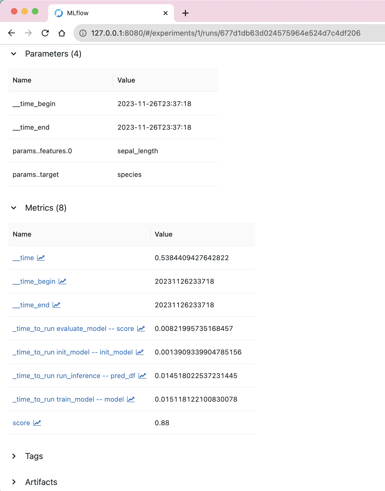
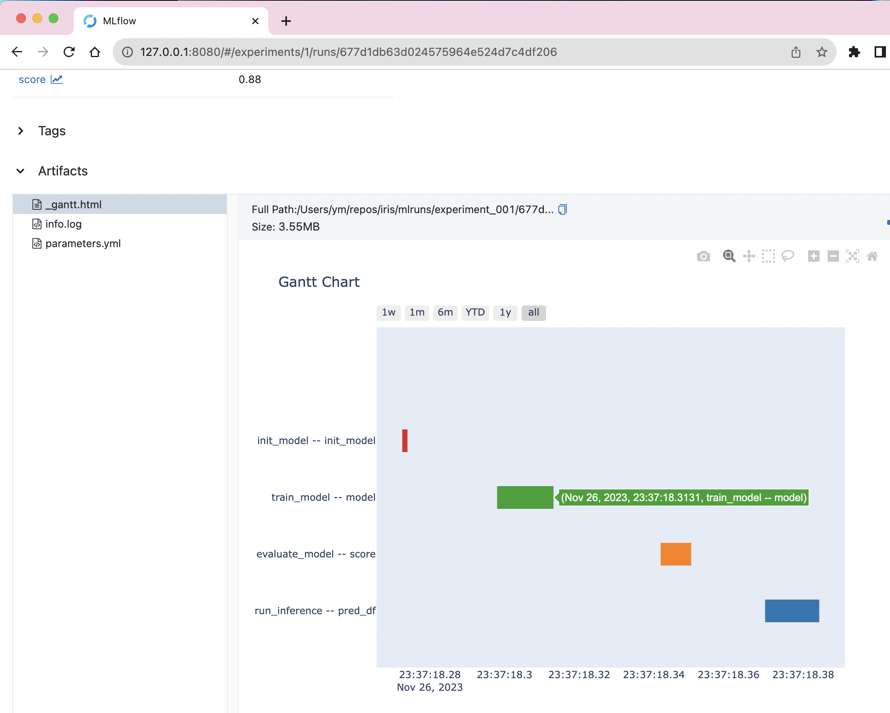

# Kedro Starters using Scikit-learn and MLflow

This repository provides Kedro starters that demonstrate how to use Kedro (0.17.0 or later) developed based on [`pandas-iris` starter](https://github.com/quantumblacklabs/kedro-starters/tree/master/pandas-iris) including:

- `sklearn-iris` trains a Logistic Regression model using Scikit-learn.
- `sklearn-pycatalog-iris` allows to define Kedro Catalog in Python code in addition to YAML.
- `sklearn-mlflow-pycatalog-iris` adds experiment tracking feature using MLflow.
- `sklearn-mlflow-yamlholic-iris` enables you to define Python objects (e.g. models), Kedro pipeline, and run config in YAML.

<p align="center">

Pipeline visualized by Kedro-viz
</p>

## `sklearn-iris` template

### Iris dataset

[Iris dataset](https://www.kaggle.com/uciml/iris) is included and used in default.
- Modification: for each species, setosa is encoded to 0, versicolor is encoded to 1, and virginica samples were removed.
- Split: for each species, first 25 samples were included in train.csv, and last 25 samples were included in test.csv.

### How to use

1. Install dependencies.

    ```bash
    pip install 'kedro>=0.17.0' pandas scikit-learn 
    ```

2. Generate your Kedro starter project from `sklearn-iris` directory.

    ```bash
    kedro new --starter https://github.com/Minyus/kedro-starters-sklearn.git --directory sklearn-iris
    ```
    As explained by [Kedro's documentaion](https://kedro.readthedocs.io/en/stable/02_get_started/04_new_project.html), enter project_name, repo_name, and python_package. 

    Note: As your Python package name, choose a unique name such as "kaggle_fraud_detection" and avoid a generic name such as "test" or "sklearn" used by another package. You can see the list of importable packages by running `python -c "help('modules')"`.

3. Change the current directory to the generated project directory.

    ```bash
    cd /path/to/project/directory
    ```

4. Run the project.

    ```bash
    kedro run
    ```

    Alternatively:

    ```bash
    python main.py
    ```

### Debugging using Visual Studio Code (VSCode)

See the [document](https://code.visualstudio.com/docs/editor/debugging#_launch-configurations) and set up `launch.json` as follows.

```json
{
    "version": "0.2.0",
    "configurations": [
        {
            "name": "My Project Debug Config",
            "cwd": "/path/to/project/directory",
            "type": "python",
            "program": "main.py",
            "request": "launch",
            "console": "integratedTerminal"
        }
    ]
}
```

### Option to use Kaggle Titanic dataset

1. Download [Kaggle Titanic dataset](https://www.kaggle.com/c/titanic/data)
2. Replace `train.csv` and `test.csv` in `/path/to/project/directory/data/01_raw` directory
3. Modify `/path/to/project/directory/base/parameters.yml` to set parameters appropriate for the dataset (commented out in default)


## `sklearn-pycatalog-iris` template

This template adds flexibility to define your Kedro DataSet Catalog in Python code ([`src/<python_package>/catalogs/catalog.py`](sklearn-pycatalog-iris/%7B%7B%20cookiecutter.repo_name%20%7D%7D/src/%7B%7B%20cookiecutter.python_package%20%7D%7D/catalogs/catalog.py)) in addition to YAML ([`conf/base/catalog.yml`](sklearn-pycatalog-iris/%7B%7B%20cookiecutter.repo_name%20%7D%7D/conf/base/catalog.yml
)).

You may prefer this template if:
- You want to feed dynamic arguments (e.g. timestamp) to your Kedro DataSet objects in Python code while you may still want to define Kedro DataSet objects with only constant arguments in YAML.
- You want to utilize code auto-completion feature provided by your Python IDE (e.g. Visual Studio Code, PyCharm).
- You are not familiar with YAML.

### How to use

1. Install dependencies.

    ```bash
    pip install 'kedro>=0.17.0' pandas scikit-learn 
    ```

2. Generate your Kedro starter project from `sklearn-pycatalog-iris` directory.

    ```bash
    kedro new --starter https://github.com/Minyus/kedro-starters-sklearn.git --directory sklearn-pycatalog-iris
    ```
3. Follow the same steps as `sklearn-iris` template.

## `sklearn-mlflow-pycatalog-iris` template

This template integrates MLflow to Kedro using [PipelineX](https://github.com/Minyus/pipelinex). Even without writing MLflow code, you can:
- configure MLflow Tracking
- log inputs and outputs of Python functions set up as Kedro nodes as parameters (e.g. features used to train the model) and metrics (e.g. F1 score).
- log execution time for each Kedro node and DataSet loading/saving as metrics.
- log artifacts (e.g. models, execution time Gantt Chart visualized by Plotly, `parameters.yml` file)

In this template, MLflow logging is configured in Python code at [`src/<python_package>/mlflow/mlflow_config.py`](sklearn-mlflow-pycatalog-iris/%7B%7B%20cookiecutter.repo_name%20%7D%7D/src/%7B%7B%20cookiecutter.python_package%20%7D%7D/mlflow/mlflow_config.py) 

See [here](https://github.com/Minyus/pipelinex#integration-with-mlflow-by-kedro-hooks-callbacks) for details.

### How to use

1. Install dependencies.

    ```bash
    pip install 'kedro>=0.17.0' pandas scikit-learn mlflow plotly
    ```

2. Generate your Kedro starter project from `sklearn-mlflow-pycatalog-iris` directory.

    ```bash
    kedro new --starter https://github.com/Minyus/kedro-starters-sklearn.git --directory sklearn-mlflow-pycatalog-iris
    ```
3. Follow the same steps as `sklearn-pycatalog-iris` template.

### Access MLflow web UI

To access the MLflow web UI, launch the MLflow server.

```bash
mlflow server --host 0.0.0.0 --backend-store-uri sqlite:///mlruns/sqlite.db --default-artifact-root ./mlruns
```

<p align="center">

Logged metrics shown in MLflow's UI
</p>

<p align="center">

Gantt chart for execution time, generated using Plotly, shown in MLflow's UI
</p>

## `sklearn-mlflow-yamlholic-iris` template

This template enables you to define Python objects (e.g. Scikit-learn models), Kedro pipeline, and run config in YAML using [PipelineX](https://github.com/Minyus/pipelinex).
If you love YAML, this is the one for you.

For details, please see:
- https://github.com/Minyus/pipelinex#pythonic-enhanced-yamljson-hatchdict
- https://github.com/Minyus/pipelinex#enhanced-kedro-context-yaml-interface-for-kedro-pipelines

### How to use

1. Install dependencies.

    ```bash
    pip install 'kedro>=0.17.0' pandas scikit-learn mlflow plotly
    ```

2. Generate your Kedro starter project from `sklearn-mlflow-yamlholic-iris` directory.

    ```bash
    kedro new --starter https://github.com/Minyus/kedro-starters-sklearn.git --directory sklearn-mlflow-yamlholic-iris
    ```
3. Follow the same steps as `sklearn-mlflow-pycatalog-iris` template.
