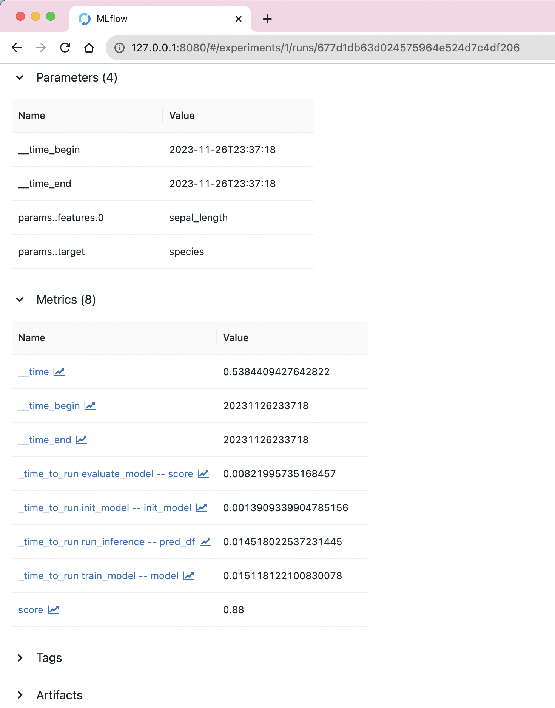
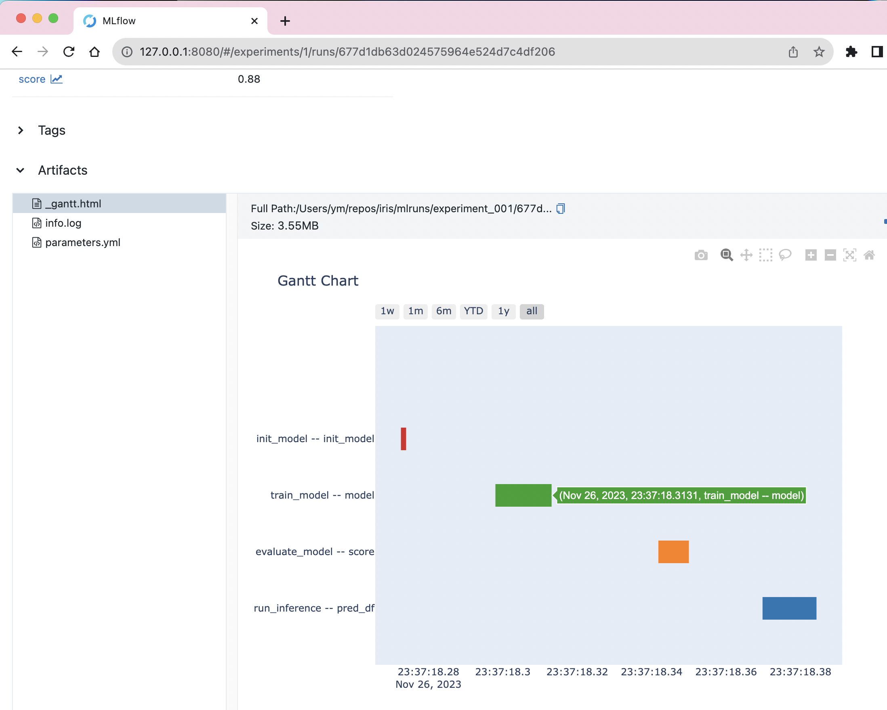
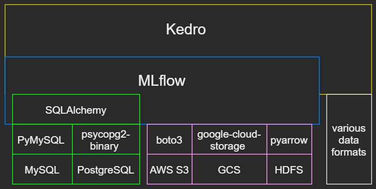
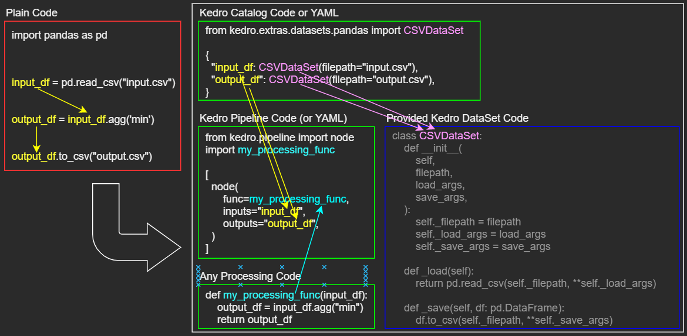
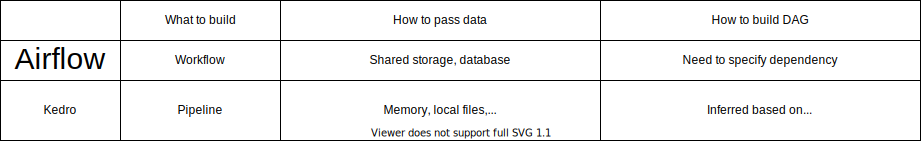
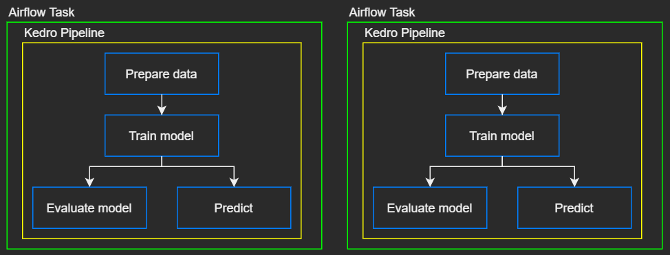

# Experiment Tracking & Model Management with MLflow and Kedro

<!--
_backgroundImage: url('https://images.pexels.com/photos/19670/pexels-photo.jpg?auto=compress&cs=tinysrgb&dpr=2&h=650&w=940')
-->

<p align=center>
Yusuke Minami
</p>


## Agenda

1. Experiment Tracking & Model Management
2. How MLflow can resolve the pain points
3. How Kedro can resolve the pain points 
4. Summary


## Experiment Tracking

- Experiment Tracking by storing metadata:
    - "parameters" (string)
        - inputs
            - model config/hyperparameters (e.g. optimizer="Adam")
            - Git commit hash (e.g. "d796df3")
            - Git commit message (e.g. "Increase kernel size")
            - data versions
    - "metrics" (numeric)
        - inputs
            - model config/hyperparameters (e.g. conv_kernel_size=3)
        - outputs
            - model evaluation metrics (e.g. accuracy, F1 score)
            - execution time


## Model Management

- Model Management by storing artifacts:
    - models (e.g. pickle, PyTorch pt/pth, TensorFlow pb)
    - visualization of model behaviors (e.g. html, png, pdf)
        - e.g. confusion matrix
    - sample predictions (e.g. csv)
    - features & labels used for training (e.g. csv)
    - log files


## Pain points of Experiment Tracking & Model Management

Experiment Tracking:
- Writing to an experiment CSV file?
    - hard to share the updated results with teammates
        - need to upload the CSV file to common storage (e.g. Google Drive)
- Writing to a database?
    - coding will be time-consuming  

Model Management:
- Hard to search artifact files

Any solution? 

## Tools for Experiment Tracking & Model Management

```
- MLflow
- DVC
- Pachyderm
- Sacred
- Polyaxon
- Allegro Trains
- VertaAI ModelDB
- Guild AI
- Kubeflow Metadata
- Weights & Biases
- Neptune.ai
- Valohai
- Comet
```

Reference:
https://github.com/Minyus/Tools_for_ML_Lifecycle_Management


## Why MLflow?

- All features (except access control) are free for multiple users
- Supports various backend databases with SQLAlchemy
  - MySQL, PostgreSQL, SQLite
- Supports various backend storages
  - AWS S3, GCS (Google Cloud Storage), HDFS (Hadoop Distributed File System), etc.
- Accessible to the backend database & storage without using MLflow server
- Intuitive API & web UI
- Package-specific auto-logging option (experimental)
  - TensorFlow/Keras, PyTorch Lightning, Scikit-learn, LightGBM, XGBoost, etc.
- Active development & community


## MLflow Architecture


## How MLflow works


## UI for Experiment Tracking

- view/search/filter/visualize params/metrics
- download experiment table CSV file




## UI for Model Management

- view artifact files 
  - text, YAML, JSON
  - image
  - html
  - pdf
  - GeoJSON
- download artifacts
  - models
  - visualization
  - prediction samples




## Python API for MLflow Tracking

```python
# set MLFLOW_TRACKING_URI environment variable

import mlflow

experiment_name = "experiment_001"
artifact_location="./mlruns/experiment_001",  # Ignored if the experiment_name already exists

try:
    experiment_id = mlflow.create_experiment(
        name=experiment_name,
        artifact_location=artifact_location
    )
except mlflow.exceptions.MlflowException:  # If the experiment already exists
    experiment_id = mlflow.get_experiment_by_name("experiment_name").experiment_id

mlflow.start_run(experiment_id)

mlflow.log_params({"param_name": "foo"})
mlflow.log_metrics({"metric_name": 123})
mlflow.log_artifact("local_path")

mlflow.end_run()
```

## Example Python code for MLflow Tracking

```python
import time

enable_mlflow = True

if enable_mlflow:
    import os
    import mlflow

    experiment_name = "experiment_001"

    experiment_id = mlflow.get_experiment_by_name(experiment_name).experiment_id
    mlflow.start_run(experiment_id=experiment_id)

    mlflow.log_params(
        {
            "env..CI_COMMIT_SHA": os.environ.get("CI_COMMIT_SHA", ""),
            "env..CI_COMMIT_MESSAGE": os.environ.get("CI_COMMIT_MESSAGE", ""),
        }
    )

data = open(local_input_data_path).read()

time_begin = time.time()

# Run processing here

time = time.time() - time_begin
time_dict = {"__time": time}

open(local_output_data_path, "w").write(data)

if enable_mlflow:
    mlflow.log_metrics(time_dict)
    mlflow.log_artifact(local_output_data_path)
    mlflow.end_run()
```

## Example Python code for searching & downloading

```python
from mlflow.tracking import MlflowClient
from mlflow.entities import ViewType

client = MlflowClient()

run = client.search_runs(
    experiment_ids="123",
    filter_string="params.__time_begin = '2020-12-31T23:59:59'",
    run_view_type=ViewType.ACTIVE_ONLY,
    max_results=1,
    order_by=[],  # ["metrics.score DESC"]
)[0]

run_id = run.info.run_id

downloaded_path = client.download_artifacts(
    run_id=run_id,
    path="model.pkl",
    dst_path="/tmp",
)

```

## Pain points of direct use of MLflow Python API

Messy!

- MLflow code would "contaminate" your processing code
    - becomes an obstacle to reuse your code in the live service
    - becomes an obstacle for unit testing
- No API for logging execution time
    - Need to add 2 separate lines (before and after) or use a Python decorator
    - Need to specify unique names for each processing

Any solution?

## Higher abstraction layer can resolve the pain points




## Kedro

Python package to build pipelines which separate data interfaces and processing.




## Kedro project directory tree

```
- conf
    - base
        - catalog.yml <-- define "DataSets"
        - logging.yml
        - parameters.yml <-- define "DataSet" values
- src
    - <package>
        - catalogs
            - catalog.py <-- define "DataSets"
        - mlflow
            - mlflow_config.py
        - pipelines
            - <pipeline>
                - pipeline.py <-- assign "DataSets" 
                - <nodes>.py <-- define any processing
- main.py
```


## Processing code (no Kedro/MLflow)

```python
from typing import List
import pandas as pd
from sklearn.linear_model import LogisticRegression
from sklearn.metrics import f1_score


def init_model():
    return LogisticRegression(
        C=1.23456,
        max_iter=987,
        random_state=42,
    )


def train_model(model, df: pd.DataFrame, cols_features: List[str], col_target: str):
    model.fit(df[cols_features], df[col_target])
    return model


def run_inference(model, df: pd.DataFrame, cols_features: List[str]):
    df["pred_proba"] = model.predict_proba(df[cols_features])[:, 1]
    return df


def evaluate_model(model, df: pd.DataFrame, cols_features: List[str], col_target: str):
    y_pred = model.predict(df[cols_features])
    score = float(f1_score(df[col_target], y_pred))
    return score
```


## Kedro Catalog (catalog.py)

Centralized list of "DataSets" (interfaces for {files, storages, databases})

```
[MLflowDataSet]
if `dataset` arg is:
- {"pkl", "txt", "yaml", "yml", "json", "csv", "xls", "parquet", "png", "jpeg", "jpg"}: log as an artifact
- "m": log as a metric (numeric)
- "p": log as a param (string)
```

```python
from kedro.extras.datasets.pandas import CSVDataSet
from pipelinex import MLflowDataSet

catalog_dict = {
    "train_df": CSVDataSet(
        filepath="data/01_raw/train.csv",  # Read a csv file
    ),
    "test_df": CSVDataSet(
        filepath="data/01_raw/test.csv",  # Read a csv file
    ),
    "model": MLflowDataSet(dataset="pkl"),  # Write a pickle file & upload to MLflow
    "pred_df": MLflowDataSet(dataset="csv"),  # Write a csv file & upload to MLflow
    "score": MLflowDataSet(dataset="m"),  # Write an MLflow metric
}
```

## Config (parameters.yml)

- Optionally, specify input DataSet values in YAML config file

```yaml
# Columns used as features ("params:features" DataSet)
features: 
  - sepal_length

# Column used as the target ("params:target" DataSet)
target: species
```


## Kedro Pipeline (pipeline.py)

- For each input & output of Python functions, assign a Kedro "DataSet" (interface) name
- DAG will be inferred based on "DataSet" names

```python
Pipeline(
    [
        node(func=init_model, inputs=None, outputs="init_model"),
        node(
            inputs=["init_model", "train_df", "params:features", "params:target"],
            func=train_model,
            outputs="model",
        ),
        node(
            inputs=["model", "train_df", "params:features", "params:target"],
            func=evaluate_model,
            outputs="score",
        ),
        node(
            inputs=["model", "test_df", "params:features"],
            func=run_inference,
            outputs="pred_df",
        ),
    ]
)
```


## MLflow Config (mlflow_config.py)

```python
import pipelinex

mlflow_hooks = (
    pipelinex.MLflowBasicLoggerHook(
        uri="sqlite:///mlruns/sqlite.db",
        experiment_name="experiment_001",
        artifact_location="./mlruns/experiment_001",  # Ignored if the experiment_name already exists
    ),  # Configure and log duration time for the pipeline
    pipelinex.MLflowCatalogLoggerHook(
        auto=True,  # If True (default), for each dataset (Python func input/output) not listed in catalog, 
        # log as a metric for {float, int} types, and log as a param for {str, list, tuple, dict, set} types.
    ),  # Enable MLflowDataSet
    pipelinex.MLflowArtifactsLoggerHook(
        filepaths_before_pipeline_run=[
            "conf/base/parameters.yml"
        ],  # Optionally specify the file paths to log before the pipeline runs
        filepaths_after_pipeline_run=[
            "logs/info.log",
            "logs/errors.log",
        ],  # Optionally specify the file paths to log after the pipeline runs
    ),
    pipelinex.MLflowTimeLoggerHook(),  # Log duration time to run each node (task)
)
```

## Available data interfaces

- Kedro DataSet interfaces
    - 25 Official DataSets in [kedro.extras.datasets](https://kedro.readthedocs.io/en/stable/kedro.extras.datasets.html#data-sets)
        - Pickle, CSV, Parquet, Feather, SQL, text, YAML, JSON, GeoJSON, etc.
    - More DataSets in [pipelinex.extras.datasets](https://github.com/Minyus/pipelinex#additional-kedro-datasets-data-interface-sets)
        - [pipelinex.MLflowDataSet](https://github.com/Minyus/pipelinex/blob/master/src/pipelinex/extras/datasets/mlflow/mlflow_dataset.py)
        - [pipelinex.ImagesLocalDataSet](https://github.com/Minyus/pipelinex/blob/master/src/pipelinex/extras/datasets/pillow/images_dataset.py
        )
            - loads/saves multiple numpy arrays (RGB, BGR, or monochrome image) from/to a folder in local storage using `pillow` package
        - [pipelinex.IterableImagesDataSet](https://github.com/Minyus/pipelinex/blob/master/src/pipelinex/extras/datasets/torchvision/iterable_images_dataset.py)
            - wrapper of [`torchvision.datasets.ImageFolder`](https://pytorch.org/docs/stable/torchvision/datasets.html#imagefolder) 
        - [pipelinex.AsyncAPIDataSet](https://github.com/Minyus/pipelinex/blob/master/src/pipelinex/extras/datasets/httpx/async_api_dataset.py)
            - downloads multiple contents (e.g. images) by async HTTP requests
- Include in task processing code: Low modularity, but often quicker in short-term


## Kedro run options

To run the pipeline 
```bash
python -m kedro run
```

To run the pipeline in parallel
```bash
python -m kedro run --parallel
```

To resume the pipeline from stored intermediate data (e.g. features, models)
```bash
python -m kedro run --from-inputs dataset_1,dataset_2
```

Reference: https://kedro.readthedocs.io/en/stable/09_development/03_commands_reference.html


## Debug using Visual Studio Code (VS Code)

See the [VS Code document](https://code.visualstudio.com/docs/editor/debugging#_launch-configurations) and set up `launch.json` as follows.

```json
{
    "version": "0.2.0",
    "configurations": [
        {
            "name": "My Project Debug Config",
            "cwd": "/path/to/project/directory",
            "type": "python",
            "program": "main.py",
            "request": "launch",
            "console": "integratedTerminal"
        }
    ]
}
```

## Airflow and Kedro



Can be used together in different level




## Pros and cons of Kedro

- Pros:
    - High modularity/reusability
        - task processing
        - read/write {local file, remote storage, database} with/without MLflow 
        - non-task code 
            - measure execution time
    - Auto parallel run using `multiprocessing`
        - Easily disable for debugging
    - Visualization of pipeline DAG 
- Cons:
    - It may take some time to learn


## Installation

To use MLflow:
- ` pip install mlflow `

To use a backend database for MLflow:
- MySQL: ` pip install PyMySQL `
- PostgreSQL: ` pip install psycopg2-binary ` 

To use a backend storage for MLflow:
- AWS S3: ` pip install boto3 `
- GCS: ` pip install google-cloud-storage `
- HDFS: ` pip install pyarrow `

To use Kedro interface of MLflow API: 
- ` pip install kedro pipelinex plotly ` 


## References

MLflow's official document:
https://mlflow.org/docs/latest/index.html

Kedro's official document:
https://kedro.readthedocs.io/en/stable/index.html

Kedro starters (Cookiecutter templates) using Scikit-learn and MLflow:
https://github.com/Minyus/kedro-starters-sklearn


## Summary

- MLflow resolves pain points of Experiment Tracking & Model Management
- but MLflow API would "contaminate" your processing code
- but Kedro resolves the pain points by separating MLflow (and other data access) code from your processing code
- Kedro also supports parallel run
- MLflow/Kedro can be used with/without Airflow


